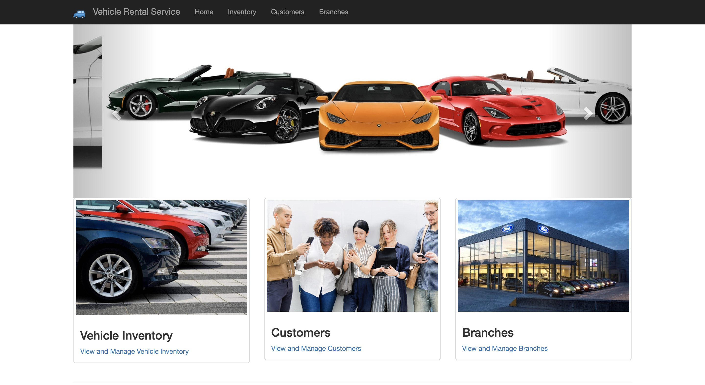
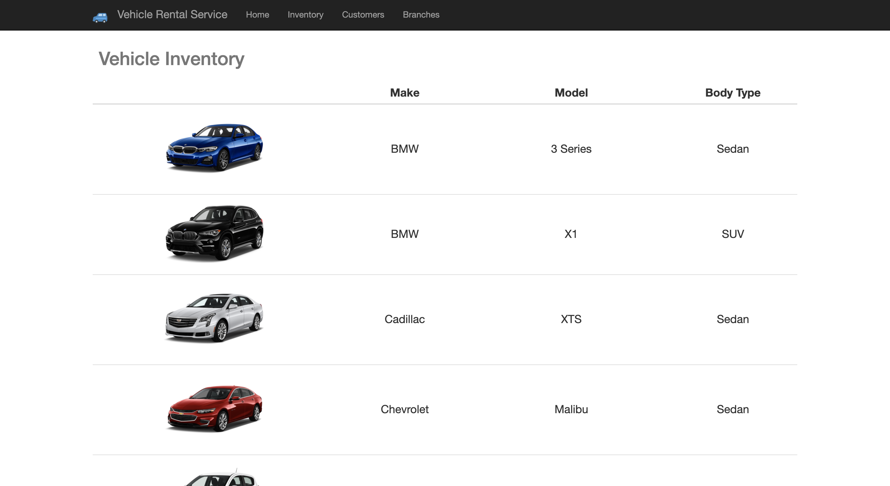
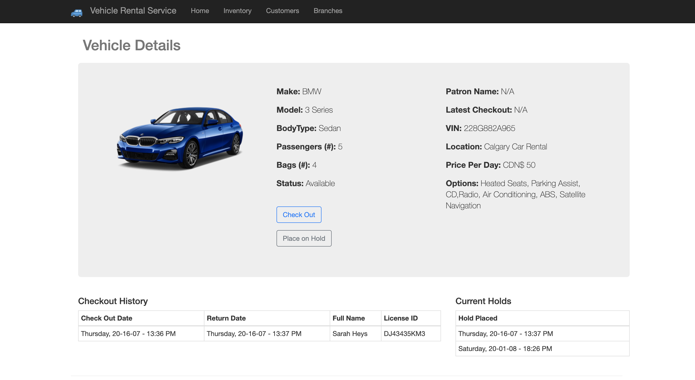
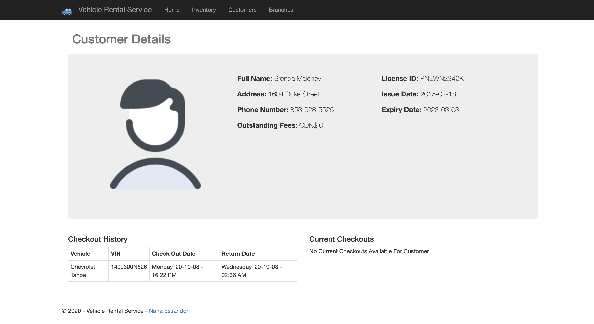
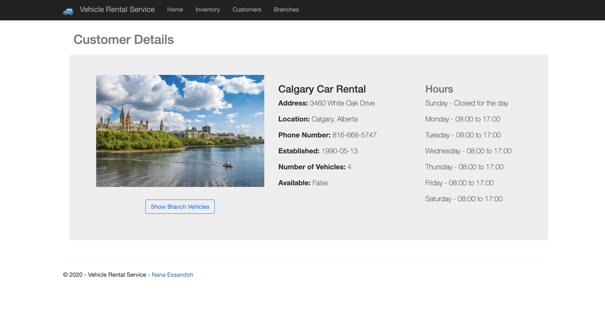

# Vehicle Rental Management System

Vehicle Rental Management System using ASP.Net Core MVC

Live Demo Available [Here](http://vehiclerental.azurewebsites.net/)

## Images






## Features Test
- Responsive web design
  - [See mobile emulators](https://www.responsinator.com/?url=https%3A%2F%2Fvehiclerental.azurewebsites.net%2F)
- Mobile friendly
  - [Run Mobile-Friendly Test](https://search.google.com/test/mobile-friendly?id=gvrwsdcX6Ux-Vr0vbr-hmg)
- Meets highest accessibility standards 
  - [Run accessibility validator](https://wave.webaim.org/report#/http://vehiclerental.azurewebsites.net/)
- High performance. Gets 89/100 points on Google PageSpeed Insights for Desktop
  - [Run PageSpeed Insights](https://developers.google.com/speed/pagespeed/insights/?url=http%3A%2F%2Fvehiclerental.azurewebsites.net%2F)


## How to use

On the command line, install the template.

```cmd
cd Vehicle-Rental
dotnet watch run
```

After the command shell indicates that the app has started, browse to 

```cmd
https://localhost:5001
```